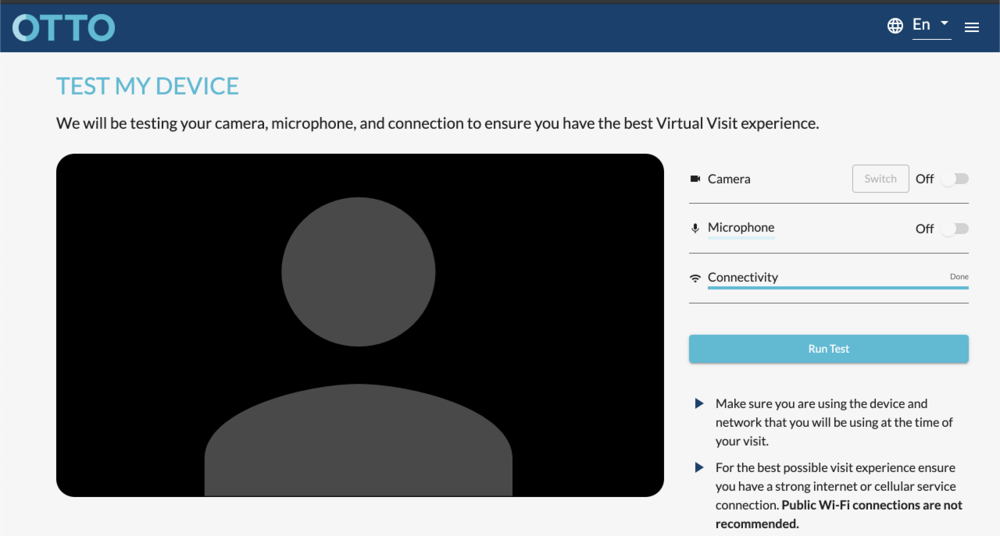

# vue-app

## Requirements

Create a Vue.js (with Vuetify framework) app which mimics this interface:


#### Key features
 
 - Show webcam video stream;
 - Allow user to enable/disable webcam;
 - Allow user to enable/disable microphone input;
 - Show volume level of microphone;
 - Add user input field with simple validation;
 - Perform external API call from the component on load & on user action;

## Project setup
```
yarn install
```

### Compiles and hot-reloads for development
```
yarn serve
```
